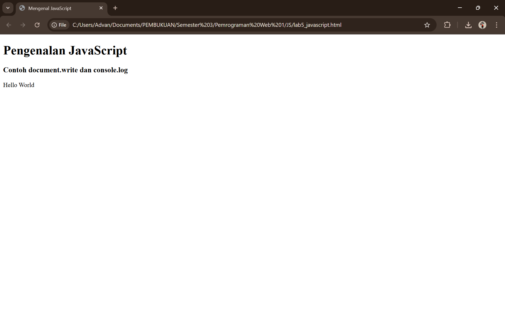

# Laporan Pratikum 5 - JAVASCRIPT
### NAMA : Dafa Maulana Makmudin
### NIM : 312410387
### KELAS : TI.24.A3

# Langkah-langkah Praktikum

## Alert Box
Input:

Output:

## Form
Input: 

Output:

## Form2
Input:

Output:

## Daftar Menu Makanan
Input:

Output:

## If-Else
Input:

Output:

## Pengenalan JavaScript
Input:

Output:

## Input Nama
Input:

Output:

## Program
Input:

Output:

## Program 2
Input:

Output:

## Program 3
Input:

Output:

## Script
Input:

Output:

# TUGAS

## INPUT

## OUTPUT

